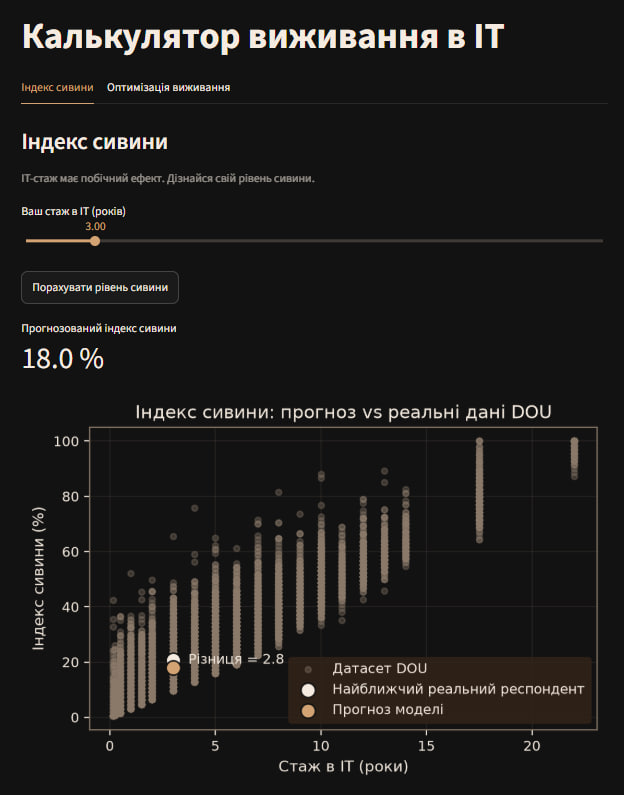
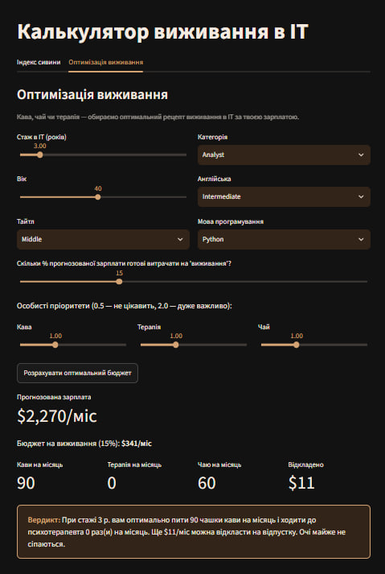

# Калькулятор виживання в ІТ

End-to-end аналітичний проєкт: від сирого CSV до задеплоєного веб-застосунку.

**[▶ Демо](https://it-survival-calculator.streamlit.app/)**
&nbsp;|&nbsp;


---

## Про проєкт

Streamlit-застосунок на **реальному датасеті зарплат DOU (грудень 2025, 12 396 респондентів)**.
Дві аналітичні вкладки поєднують дві теми курсу — Machine Learning та Оптимізацію:
проста лінійна регресія прогнозує "індекс сивини" за ІТ-стажем, а лінійне програмування
розподіляє прогнозований бюджет між кавою, терапією, чаєм і заощадженнями.

---

## Tech Stack

| | | | | |
|---|---|---|---|---|
|  |  |  |  |  |

*Також:* `joblib` (серіалізація моделей), `matplotlib` (візуалізація, стилізована під тему застосунку).

---

## Вкладки

### Індекс сивини — Machine Learning



Проста лінійна регресія: `X` — роки ІТ-стажу, `y` — індекс сивини (умовна метрика,
порахована з віку та стажу за формулою `experience×3.2 + max(0, age−24)×1.4`, обрізана
до 0–100%). Графік розсіювання показує прогноз моделі поруч із найближчим реальним
респондентом того самого стажу з датасету DOU.

---

### Оптимізація виживання — Machine Learning + Оптимізація



1. **Прогноз зарплати** — багатофакторна лінійна регресія (`OneHotEncoder` для
   тайтлу/категорії/мови + `LinearRegression`) за стажем, віком, тайтлом, категорією,
   рівнем англійської та мовою програмування.
2. **Лінійне програмування** (`scipy.optimize.linprog`) розподіляє бюджет виживання між
   кавою, терапією, чаєм і заощадженнями так, щоб максимізувати "продуктивність" у межах
   бюджету — справжня LP-задача з цільовою функцією, обмеженнями та межами змінних.
3. **Слайдери особистих пріоритетів** зміщують вагові коефіцієнти цільової функції —
   наприклад, підвищення пріоритету терапії може перемкнути оптимальний розподіл навіть
   при вищій ціні за сеанс.

---

## Ключові інсайти

- **12 396** очищених анкет DOU (грудень 2025) використано для навчання
- **R² ≈ 0.54** для прогнозу зарплати на 6 ознаках — типовий результат для лінійної моделі
  без даних про компанію й регіон
- Тайтли згорнуто з **15 до 11** рівнів сеньйорності, категорії — з **38 до 33**
  (об'єднано семантично близькі варіанти, напр. три типи підтримки → "Support")
- LP-оптимізація завжди розподіляє бюджет **повністю** (заощадження поглинають залишок
  після фізичних максимумів кави/терапії/чаю) — жодних "загублених" грошей

---

## Архітектура

```text
it-survival-calculator/
├── app.py                  # Streamlit-застосунок (2 вкладки)
├── model.py                 # навчання моделей, збереження *.joblib
├── data_utils.py             # очищення даних: парсинг стажу, групування
├── dou_raw.csv                # сирий датасет DOU (грудень 2025)
├── requirements.txt
├── .streamlit/
│   └── config.toml            # кольорова тема
└── assets/                     # скриншоти для README
```

**Ключові рішення:**
- `data_utils.py` — єдине джерело правди для очищення даних, використовується і в
  `model.py`, і опосередковано в `app.py` (через збережені `.joblib`)
- Модель зарплати навчена на **категорії**, а не вузькій посаді (240+ унікальних значень) —
  свідомий компроміс між деталізацією та стабільністю регресії
- Округлення LP-результатів **вниз** (`math.floor`) — не можна випити 0.8 чашки кави

---

## Очищення даних

| Рядків | Пропусків у ключових полях | Тайтлів | Категорій |
|:---:|:---:|:---:|:---:|
| 12 396 | 0 | 11 (з 15) | 33 (з 38) |

**Нетривіальні кейси:**
- Стаж — вільний текст ("15-20 років", "Пів року", "Менше як 3 місяці") → парситься
  регулярками й словником у числові роки
- Зарплата — обрізано верхній 1% викидів, щоб лінійна регресія не "тягнулась" за
  поодинокими суперзарплатами
- Мова програмування — топ-14 залишено, решта → "Інша"; респонденти без мови → "Не програмує"

---

## Відомі обмеження

- Лінійна регресія погано екстраполює для рідкісних комбінацій ознак (можливий
  від'ємний прогноз для нетипових поєднань — код обрізає до $0)
- Для вузьких ніш (конкретна посада) офіційний калькулятор DOU може давати точніше
  значення на малій вибірці анкет, ніж наша модель на узагальненій категорії
- "Індекс сивини" — умовна, не наукова метрика

---

## Запуск

```bash
git clone https://github.com/husak-alla/it-survival-calculator.git
cd it-survival-calculator
pip install -r requirements.txt
python model.py
streamlit run app.py
```

## Деплой

1. Запушити репозиторій на GitHub
2. Зайти на [share.streamlit.io](https://share.streamlit.io), увійти через GitHub
3. New app → обрати репозиторій, branch `main`, файл `app.py`
4. Deploy — отримати посилання виду `https://<назва>.streamlit.app`